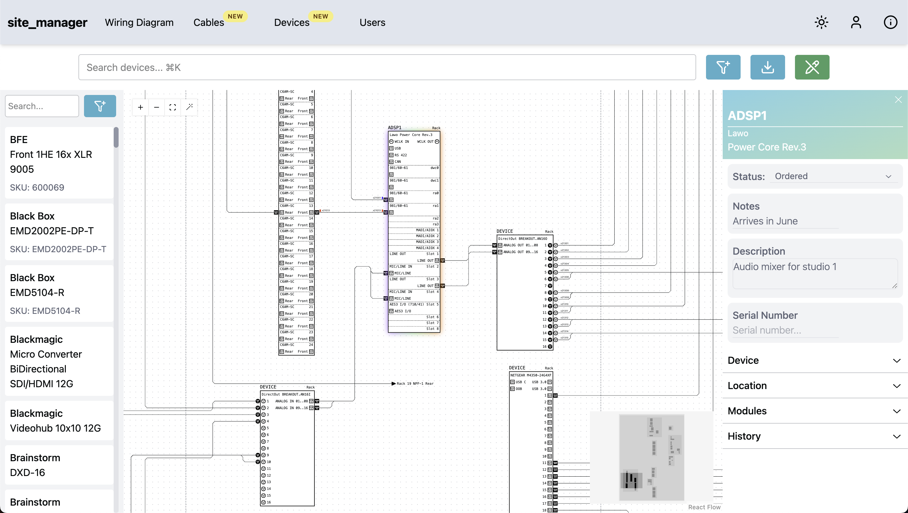

# site_manager

site_manager is a tool for documenting the wiring and installation of a broadcast system. Backed by a database, site_manager provides different views of the same underlying data, allowing you to get the complete picture.

Thanks to its intuitive visual interface, automatic creation of cable schedules and strict validation logic planning your next studio has never been simpler!

- :material-clock-fast: **Installation**
  Prebuilt Docker image to get up and running in 5 minutes
  [:octicons-arrow-right-24: Get started](installation.md)

- :fontawesome-solid-mortar-board: **Tutorial**
  Get to know all the features
  [:octicons-arrow-right-24: Get started](tutorial/gettingstarted.md)

- :material-code-json: **API**
  Learn how to automate tasks using the API
  [:octicons-arrow-right-24: Get started](api/overview.md)

- :material-camera: **Device library**
  The built in library contains over 100 devices. You can also contribute your own
  [:octicons-arrow-right-24: Learn how](library/overview.md)

