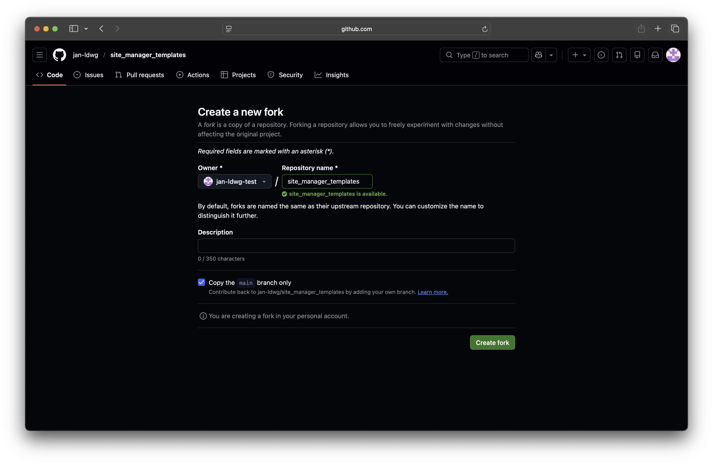
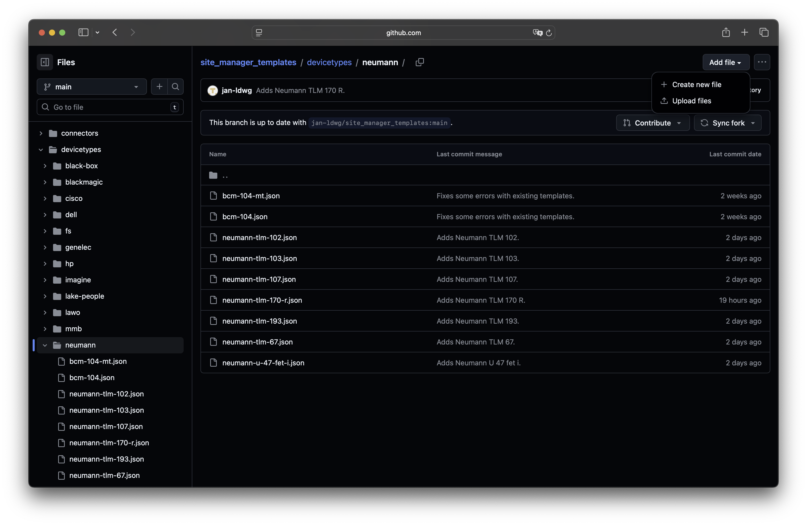
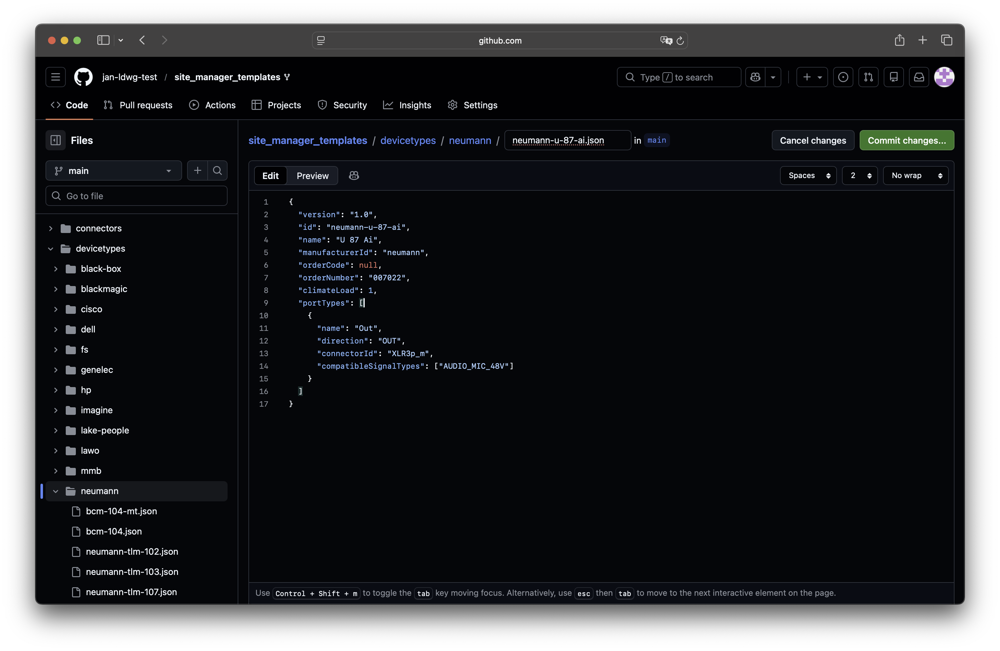

# Contribute

Contributing new templates to site_manager is the easiest and fastest way to see the devices you need become available. The whole workflow follows standard GitHub principles. If you are familiar with this you will feel right at home. If not here is an easy introduction to get started.

## Create a GitHub account

To contribute you will need a GitHub account. You can sign up [here](https://github.com/signup).

## Fork the project

Forking the project means creating a copy that you can edit.

Navigate to the [site_manager_templates repo](https://github.com/jan-ldwg/site_manager_templates).

Click `Fork -> Create a new fork`.

The default values are fine, just accept by clicking `Create fork`.

You have now created a fork and are ready to do your changes.

## Do your changes

You can do small changes right from the GitHub website. For larger changes we recommend cloning the repo locally and using an editor like VS Code.

=== "GitHub"

    If you want to add a new device type, navigate to the folder of the manufacturer and click `Add file -> Create new file`.
    

    Name the file and create the new device template. See [this guide](create.md) for details. Then click `Commit changes...`.
    

    Give the commit a meaningful message. You should commit to a new feature branch, else your `main` branch will no longer be able to properly sync with the upstream repository. You should give this branch a meaningful name, although you will not use it again. The click `Propose changes`.
    

    Navigate to the main page of your fork and switch to the just created feature branch.
    

    You will now see that your feature branch is 1 commit ahead of the main repository. Click `Contribute -> Open pull request`.
    

    A dialog will open. Be sure to add the resources you used to create the template to ensure a swift review. You don't need to change anything else. Click `Create pull request`.
    

    That's it! The automatic validation should now start and a maintainer will review your changes. They will contact you if there are any issues or further questions.
    

    After your (or any other pull request) has been merged to the upstream repository your fork will become out of date. Click `Sync fork -> Update branch` to pull the latest version of the upstream repository to your fork.
    

=== "VS Code"

    We recommend using Visual Studio Code, as it offers a native integration with GitHub. You can download it [here](https://code.visualstudio.com/Download).

    A more detailed workflow will be documented here in the future...
